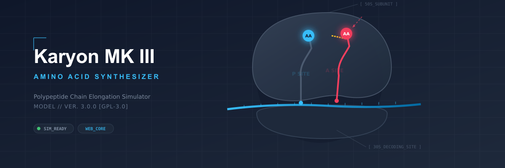

  

# 🧬 Karyon MK III – Amino Acid Synthesizer

### Interactive Visualization of Protein Translation

Browser-based educational simulation of mRNA translation, ribosomal decoding, and polypeptide synthesis.

---

## 📖 Overview

**Karyon MK III – Amino Acid Synthesizer** is an open-source educational simulator that visualizes the molecular events of protein synthesis. Designed for biology students and educators, it transforms textbook concepts into interactive, scientifically accurate browser-based animations.

---

## ✨ Features

- 🧬 Interactive ribosome simulation
- 🧬 Real-time codon decoding
- 🧬 tRNA recognition and pairing
- 🧬 Amino acid chain elongation
- 🧬 Animated protein synthesis
- 🧬 Responsive browser-based interface

---

## 📦 Included Simulations

- Initiation
- Elongation
- Translocation
- Termination

---

## 📜 License

GNU General Public License v3.0 (GPL-3.0)

---

## 👨‍🏫 Author

**Draven-Ashcroft**

**DIPS Chain of Institutions, Tanda**

---

## 🙏 Acknowledgements

Developed with assistance from modern AI tools.

Special thanks to:

- **Anthropic Claude** — implementation and optimization
- **OpenAI (ChatGPT)** — scientific review and debugging
- **Google Gemini** — concept exploration
- **Moonshot AI** — prototype refinement
- **DeepSeek** — early experimentation

Inspired by **BioRender**, **Nature Reviews**, **NCERT Biology**, and modern scientific visualization principles.

---

## 🧬 Karyon MK III – Amino Acid Synthesizer

### *From Genetic Code to Functional Protein.*

