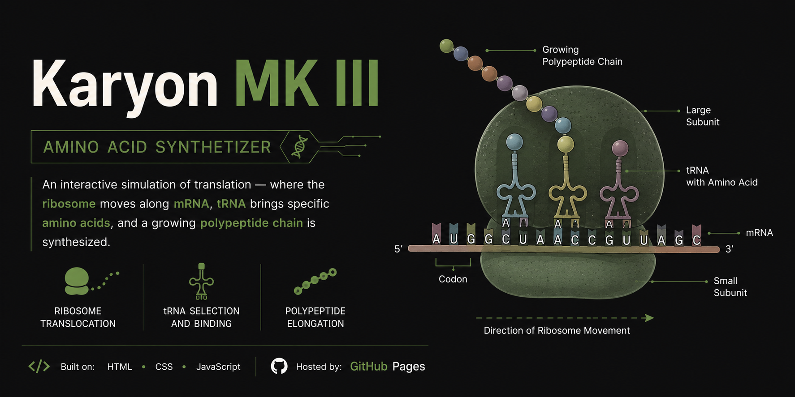

  

# 🧬 Karyon MK III

**Interactive Amino Acid Synthesizer**

---

### 📖 Overview
An interactive HTML simulator demonstrating protein translation through ribosome movement, mRNA decoding, tRNA recognition, and polypeptide chain synthesis.

### ✨ Features
- Ribosome Translocation
- Codon–Anticodon Recognition
- tRNA Selection
- Polypeptide Chain Elongation
- Interactive Translation Controls

---

### 📜 License
GPL-3.0

### 👨‍🏫 Author
**Draven-Ashcroft** | DIPS Chain of Institutions, Tanda

---

### 🙏 Credits
**Claude:** Code Architecture  
**Replit:** Debugging & Enhancement  
**OpenAI:** Debugging & Prompt Refinement
